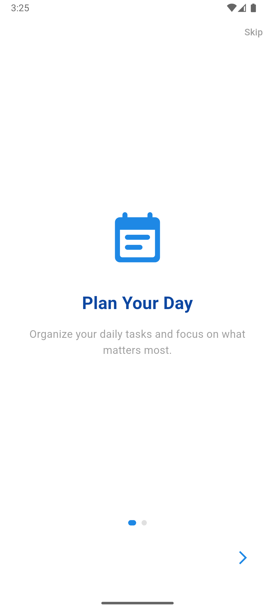
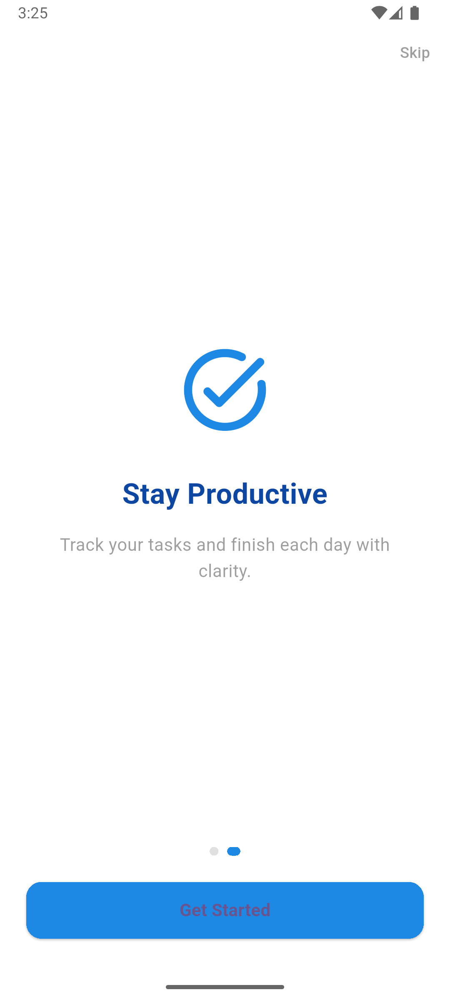
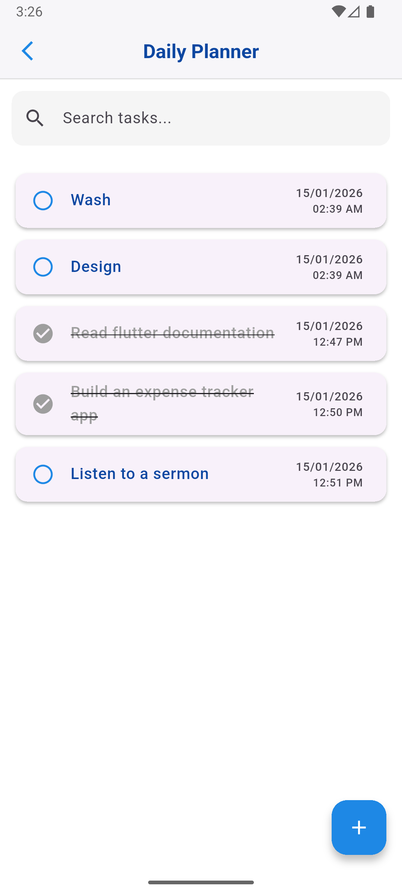
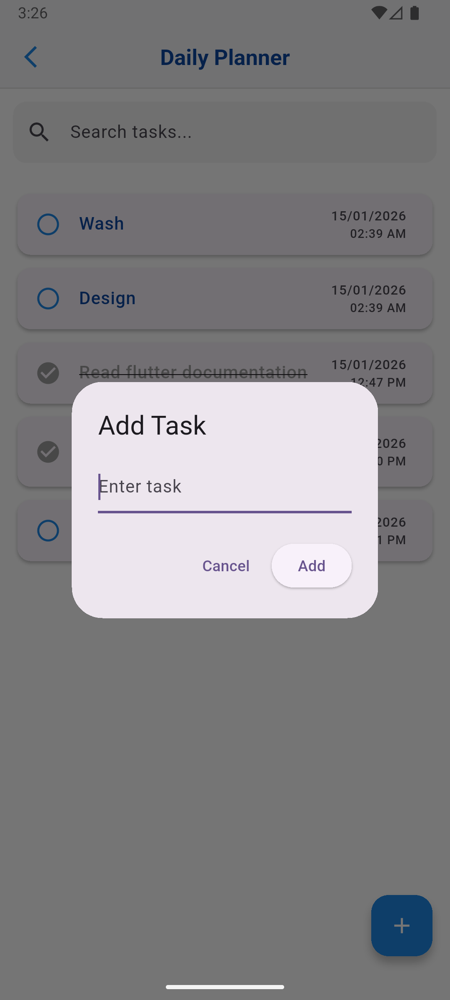
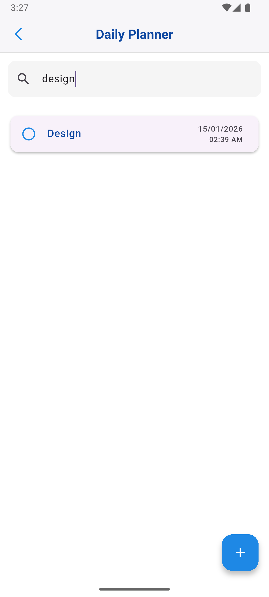

# Daily Planner App – Flutter

A simple and intuitive **Daily Planner** mobile app built with Flutter and Hive. Organize your daily tasks, track progress, and stay productive.

---

## Features

- **Intro/Onboarding Screens**: Brief walkthrough when the app launches.
- **Add Tasks**: Easily add tasks with timestamps.
- **Task List**: View all tasks with date and time.
- **Mark as Done**: Tap tasks to mark them complete; completed tasks are crossed out.
- **Search Tasks**: Quickly find tasks using the search bar.
- **Delete Tasks**: Long-press a task to delete it with confirmation popup.

---

##  Screenshots

### Intro Screens
| Intro Screen 1 | Intro Screen 2 |
|---------------|---------------|
|  |  |

### Main App Screens
| Task List | Add Task |
|-----------|----------|
|  |  |

| Search Tasks |
|--------------|
|  |


---

## How it Works

1. **Launch the App** → Intro screens are displayed with a "Skip" button or navigation arrows.
2. **Get Started** → Navigate to the main task list screen.
3. **Add a Task** → Tap the **+** button to input a new task.
4. **Mark as Complete** → Tap a task to mark it done (text gets strikethrough).
5. **Delete a Task** → Long-press a task and confirm deletion.
6. **Search Tasks** → Use the search bar to filter tasks in real-time.

> Tasks are stored locally using **Hive** for persistent storage.

---

## Getting Started

1. **Clone the repository:**
```bash
git clone https://github.com/your-username/daily-planner.git
```
2. **Install dependencies**
```bash
flutter pub get
```
1. **Run the app**
```bash
flutter run
```
